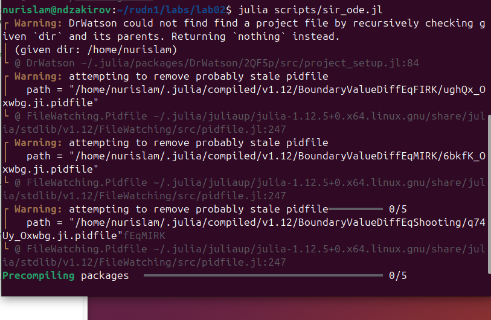
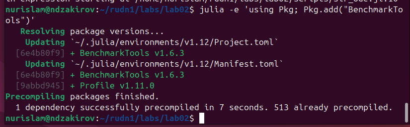
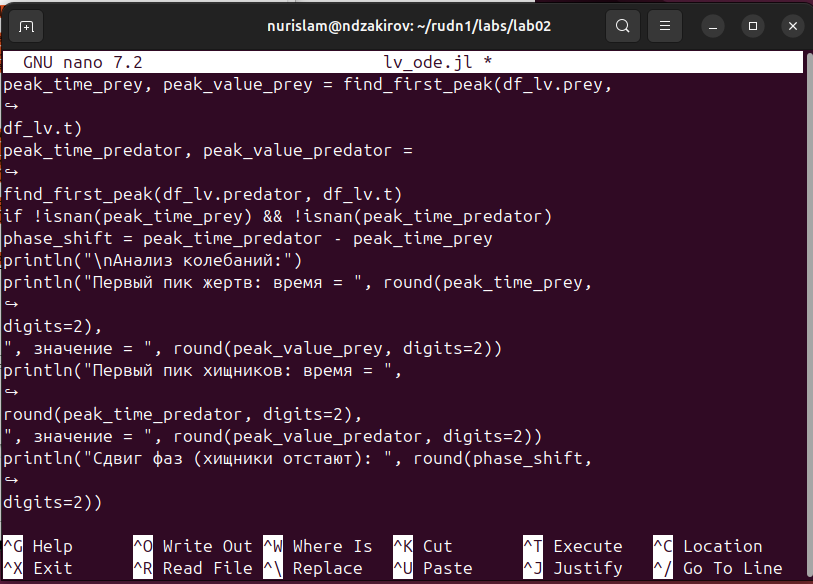
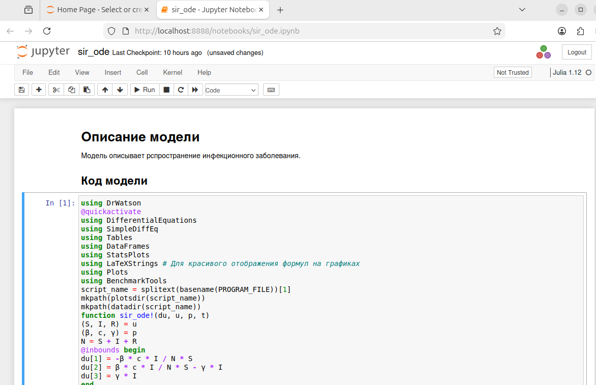
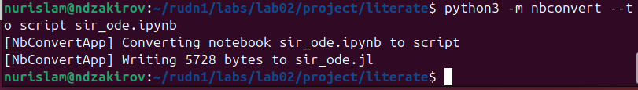
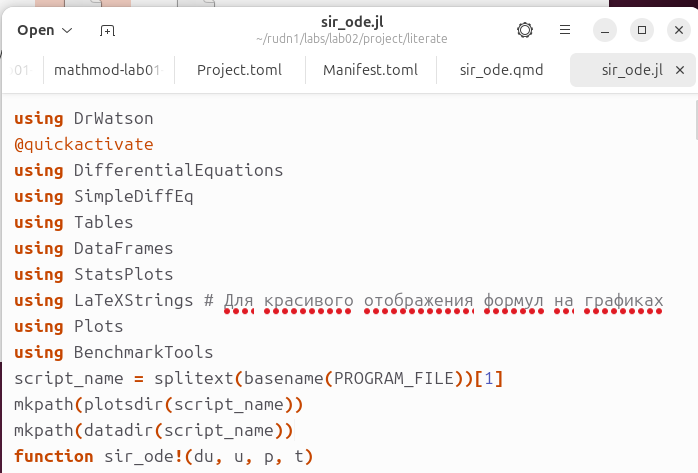
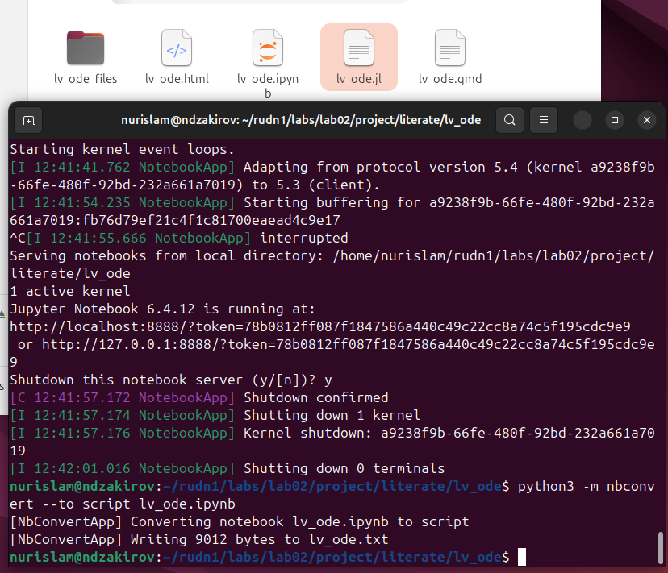
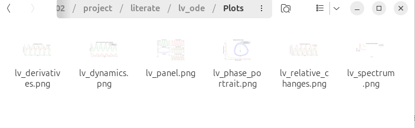

---
## Author
author:
  name: Закиров Нурислам Дамирович
  degrees: DSc
  orcid: 0000-0002-0877-7063
  email: 1132236040@rudn.ru
  affiliation:
    - name: Российский университет дружбы народов
      country: Российская Федерация
      postal-code: 117198
      city: Москва
      address: ул. Миклухо-Маклая, д. 6

## Title
title: "Лабораторая работа 2"
subtitle: "Основные модели: SIR и Лотки-Вольтерры"
license: "CC BY"
---

# Цель работы

Изучение и программная реализация базовых математических моделей: модели эпидемии SIR и модели хищник-жертва Лотки-Вольтерры. Освоение методов программирования в литературном стиле.

# Задание

* Создать рабочий каталог для кода.
* Установить необходимые пакеты.
* Выполнить предложенный код.
* Преобразовать код в литературный стиль.
* Сгенерировать из литературного кода:чистый код;jupyter notebook;документацию в формате Quarto.
* Выполнить код из jupyter notebook.
* Интегрировать документацию в формате Quarto в отчёт.
* Добавить в код в литературном стиле вычисление для набора параметров.
* Сгенерировать из литературного кода с параметрами:чистый код;jupyter notebook;документацию в формате Quarto.
* Выполнить код из jupyter notebook с параметрами.
* Интегрировать документацию с параметрами в формате Quarto в отчёт.

# Теоретическое введение

В данной лабораторной работе рассматриваются две фундаментальные математические модели.

### 1. Модель SIR

Модель SIR есть классическая и фундаментальная математическая модель эпидемиологии, описывающая распространение инфекционного заболевания в закрытой популяции. Модель делит всю популяцию на три взаимосвязанные группы (компартменты):

* 
**S** (Восприимчивые): люди, которые не болели, не имеют иммунитета и могут заразиться.


* 
**I** (Инфицированные/Заразные): люди, которые в данный момент больны и могут передавать инфекцию.


* 
**R** (Выздоровевшие/Удаленные): люди, которые переболели и приобрели иммунитет.


Динамика модели описывается тремя уравнениями:

$$\frac{dS}{dt}=-\beta IS/N$$

$$\frac{dI}{dt}=\beta IS/N-\gamma I$$

$$\frac{dR}{dt}=\gamma I$$


### 2. Модель Лотки-Вольтерры

Модель Лотки-Вольтерры — это фундаментальная математическая модель в экологии, описывающая динамику взаимодействия двух видов: хищников и жертв. Модель демонстрирует, как даже простая система взаимодействий может порождать сложные колебательные режимы.

Система состоит из двух дифференциальных уравнений:

$$\frac{dx}{dt}=\alpha x-\beta xy$$

$$\frac{dy}{dt}=\delta xy-\gamma y$$


# Выполнение лабораторной работы

## Создание рабочего каталога для кода и установка необходимых пакетов

Для начала выполнения лабораторной работы, создаем папки scripts, notebooks, docx. На первом этапе рабочий каталог будет выглядить таким образом. В дальнейшем, в ходе выполнения работы, структура каталога будет изменена. Также хочу обратить внимание на то, что все пакеты были заранее установлены на мою виртуальную мишину, поэтому данный этап мы пропускаем.([рис. @fig-001]).

{#fig-001 width=70%}

## Выполнение предложенного кода SIR.

При помощи nano sir_ode.jl создаем файл, в который мы скопировали предложенный код из инструкции по выполнению лаболаторной работы.([рис. @fig-002]).

{#fig-002 width=70%}

Далее я пытаюсь запустить данный код при помощи julia <путь к коду>. Но, как оказалось, не все пакеты были доустановленны, поэтому дожидаемся установки недостающих пакетов julia([рис. @fig-003]).

{#fig-003 width=70%}

Как мы видим, все недостающие пакеты были установлены в полном объеме.([рис. @fig-004]).

{#fig-004 width=70%}

После установки недостающик пакетов, мы успешно выполнили предложенный код из инструкции по выполнению лаболаторной работы.([рис. @fig-005]).

{#fig-005 width=70%}

Также важно посмотреть на результаты Анализа выполнения sir_ode.jl.([рис. @fig-006]).

{#fig-006 width=70%}

## Выполнение предложенного кода LV.

При помощи nano lv_ode.jl создаем файл, в который мы скопировали предложенный код модели Лотки-Вольтерры из инструкции по выполнению лаболаторной работы.([рис. @fig-007]).

{#fig-007 width=70%}

Далее я пытаюсь запустить данный код при помощи julia <путь к коду>. Но, как оказалось, опять не все пакеты были доустановленны, поэтому дожидаемся установки недостающих пакетов julia([рис. @fig-008]).

{#fig-008 width=70%}

После установки недостающик пакетов, мы успешно выполнили предложенный код модели Лотки-Вольтерры из инструкции по выполнению лаболаторной работы.([рис. @fig-009]).

{#fig-009 width=70%}

Также, считаю важным посмотреть и на результаты Анализа выполнения lv_ode.jl.([рис. @fig-010]).

{#fig-010 width=70%}

## Преобразование кода модели SIR в литературный стиль.

Слудующим важным этапы нашей работы является создание литературного стиля. Для начал мы создадим файл формата qmd для модели sir при помощи команды nano([рис. @fig-011]).

{#fig-011 width=70%}

Далее оформляем наш код в литературном стиле, разделяя коментарии от кода. Код мы окружаем метками "```{julia}```, а коментарии оставляем как есть, они автоматически считываются форматом markdown. ([рис. @fig-012]).

{#fig-012 width=70%}

## Генерация из литературного кода модели SIR в jupyter notebook.

Далее генерируем jupyter notebook, через quarto render. ([рис. @fig-013]).

{#fig-013 width=70%}

Далее запускаем jupyter notebook, через терминал. ([рис. @fig-014]).

{#fig-014 width=70%}

После чего просматриваем результат генерации и подтверждаем его корректную работу. ([рис. @fig-015]).

{#fig-015 width=70%}

## Генерация из литературного кода модели SIR в документацию в формате Quarto.

Таким же образом, при помощи quarto render конвертируем наш код формата qmd в формат html, для того, чтобы создать документацию в формате Quarto с разделением на блоки кода и комментариев. ([рис. @fig-016]).

{#fig-016 width=70%}

Далее, при помощи ls, мы видим, что генерация завершилась и в нашей дериктории создался файл sir_ode.html. ([рис. @fig-017]).

{#fig-017 width=70%}

Запускаем файл sir_ode.html и тоже убеждаемся в корректной работе генерации. ([рис. @fig-018]).

{#fig-018 width=70%}


## Генерация из литературного кода модели SIR в чистый код.

Далее при помощи nbconvert конвертируем наш код формата qmd в формат jl, для того, чтобы создать чистый код. ([рис. @fig-019]).

{#fig-019 width=70%}


Запускаем файл sir_ode.jl и снова убеждаемся в корректной работе генерации. ([рис. @fig-020]).

{#fig-020 width=70%}


## Преобразование кода модели LV в литературный стиль.

Таким же образом мы создадим файл формата qmd для модели LV при помощи команды nano([рис. @fig-021]).

{#fig-021 width=70%}

Далее оформляем наш код в литературном стиле, разделяя коментарии от кода. Код мы окружаем метками "```{julia}```", а коментарии оставляем как есть, они автоматически считываются форматом markdown. ([рис. @fig-022]).

{#fig-022 width=70%}

## Генерация из литературного кода модели LV в jupyter notebook.

Далее генерируем jupyter notebook, через quarto render. ([рис. @fig-023]).

{#fig-023 width=70%}

После чего просматриваем результат генерации и подтверждаем его корректную работу. ([рис. @fig-024]).

{#fig-024 width=70%}


## Генерация из литературного кода модели LV в документацию в формате Quarto.

Таким же образом, при помощи quarto render конвертируем наш код формата qmd в формат html, для того, чтобы создать документацию в формате Quarto с разделением на блоки кода и комментариев. ([рис. @fig-025]).

{#fig-025 width=70%}


Запускаем файл lv_ode.html и тоже убеждаемся в корректной работе генерации. ([рис. @fig-026]).

{#fig-026 width=70%}

## Генерация из литературного кода модели LV в чистый код.

Далее при помощи nbconvert конвертируем наш код формата qmd в формат jl, для того, чтобы создать чистый код и снова убеждаемся в корректной работе генерации. ([рис. @fig-027]).

{#fig-027 width=70%}

Также стоит обратить внимание что мы поменяли структуру каталогов, теперь у нас в папке project, есть папка literate, в которой лежат папки sir_ode и lv_ode. И также продемонстрирую создавшуюся папку /literate/lv_ode/Plots с изображениями всех нарисованных графиков в ходе выполнения програмного кода ([рис. @fig-028]).

{#fig-028 width=70%}


И также подтвердим выполнение данного этапа скриншотом нашего каталога, где создались все необходимые файлы ([рис. @fig-029]).

{#fig-029 width=70%}

## Добавление в код в литературном стиле вычисление для набора параметров.

Создаем sir_ode(edited), куда мы записываем sir_ode.qmd с добавлением вычисления для набора параметров, продемонстрированном на ([рис. @fig-030]).

{#fig-030 width=70%}


Код вычисление для набора параметров:

```
c_variants = [5.0, 10.0, 15.0, 20.0]
plt_sens = plot(title="Сравнение сценариев: влияние параметра c", 
                xlabel="Time (days)", 
                ylabel="Infected (I)", 
                lw=2, grid=true)

for val in c_variants
    p_test = [p[1], val, p[3]] 
    prob_test = ODEProblem(sir_ode!, u0, tspan, p_test)
    sol_test = solve(prob_test, dt = δt)
    
    R0_val = (val * p[1]) / p[3]
    plot!(plt_sens, sol_test.t, [u[2] for u in sol_test.u], 
          label="c=$val (R0=$(round(R0_val, digits=1)))")
end

display(plt_sens)
```

## Генерация из литературного кода с параметрами в чистый код;jupyter notebook;документацию в формате Quarto.

Таким же образом генерируем все требуемые форматы файла такими же методами, которые я описал выше. В результате мы получаем каталог, со всеми форматами, которые были запрошены в тз ([рис. @fig-031]).

{#fig-031 width=70%}

Продемонстрируем результат работы нашей генерации ([рис. @fig-032]).

{#fig-032 width=70%}


Также продемонстрируем график результата работы нашей генерации ([рис. @fig-033]).

{#fig-033 width=70%}

# Выводы

В ходе выполнения лабораторной работы я успешно изучил и смоделировал динамику систем по моделям SIR и Лотки-Вольтерры. Я освоил принципы литературного программирования, автоматизировал генерацию кода, Jupyter-ноутбуков и документации Quarto, а также научился исследовать влияние изменения параметров на поведение математических моделей.

# Список литературы{.unnumbered}

::: {#refs}
:::
